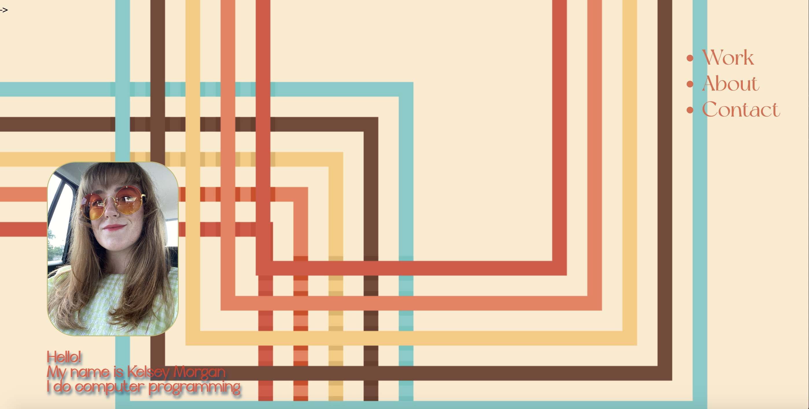
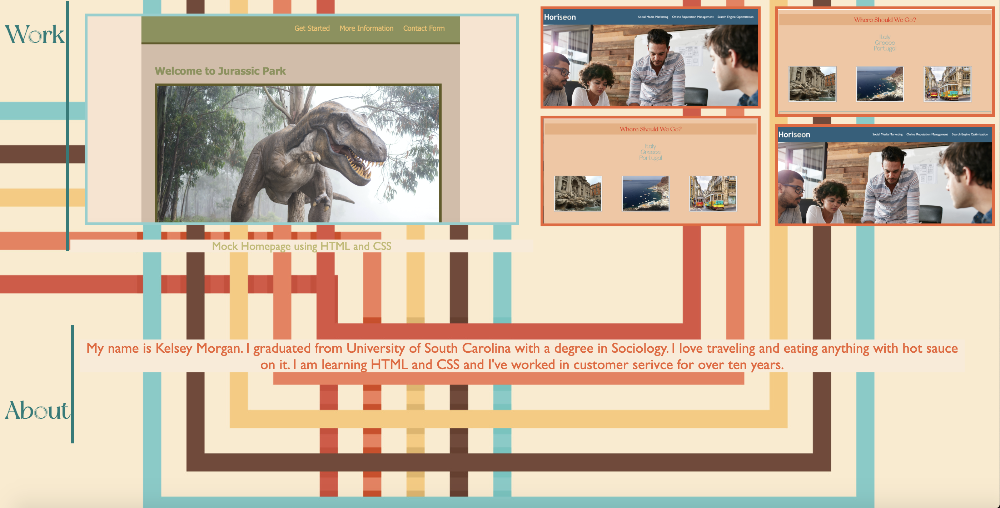
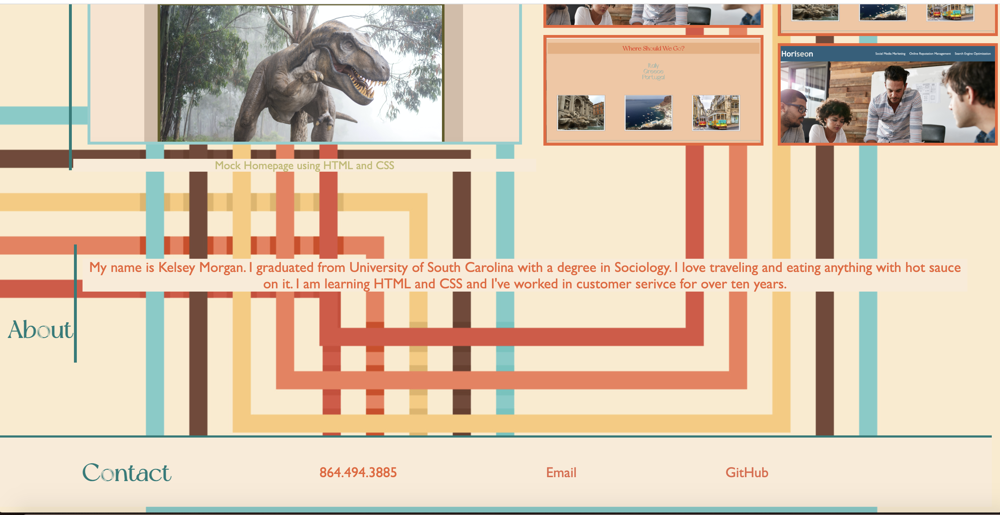

# Portfolio

## Description

This is a web application of Kelsey Morgan's current portfolio. It contains some of the projects that she has worked on currently and some information about her and how to contact her. 

This project was built to show other people the skills that Kelsey has and how she can build a website with CSS and HTML.

It does open to an application that has been deployed and changes the style when the size is shrunk down from the desktop.

## Installation

N/A

## Usage

https://morgankn.github.io/portfolio/

## Credits

N/A

## License

N/A

